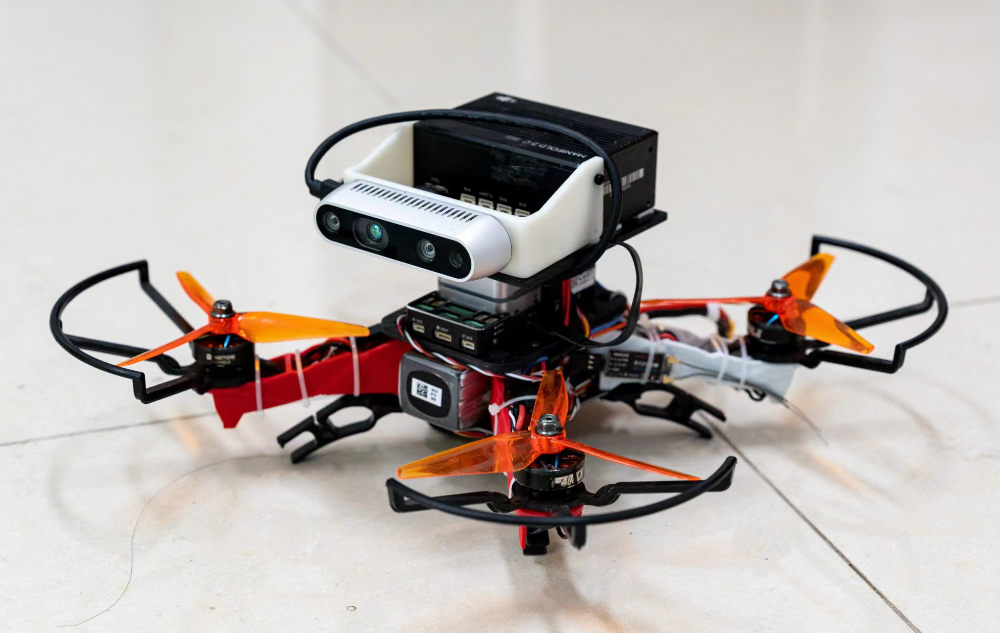
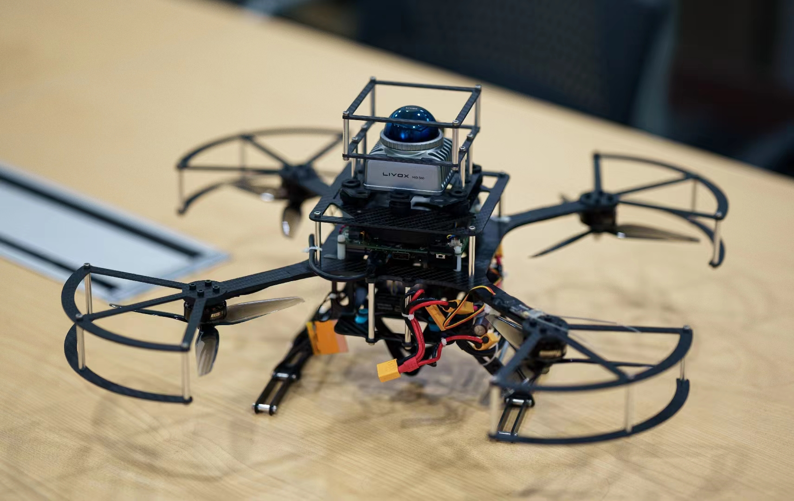

# Personal Introduction

## Education Background

- (Sep 2018 - Jul 2022) [School of Aeronautic Science and Engineering](https://www.ase.buaa.edu.cn),
    [Beihang University](https://www.buaa.edu.cn/) (BUAA)
- (Sep 2022 - Persent) [School of Aeronautic Science and Engineering](https://www.ase.buaa.edu.cn),
    [Beihang University](https://www.buaa.edu.cn/) (BUAA)

## Research Experience

<h3 style="text-align: center;">Research on obstacle avoidance of quadcopter UAVs in dense dynamic environments</h3>

  
  

Research on obstacle avoidance flight of UAVs in dynamic environments. A consistent method has been developed to distinguish between dynamic and static point clouds, which quickly obtains object estimation speeds through adjacent point cloud frames. At the same time, an active perception trajectory planning method is proposed for UAVs with limited perception field of view. n addition, based on the open-source pedestrian motion library [pedsim_ros](https://github.com/srl-freiburg/pedsim_ros) mapping in the [Gazebo](https://gazebosim.org) to simulate the motion effects of real pedestrians. (2024)

---

<h3 style="text-align: center;">Research on Dynamic Environment Perception Technology of Lidar</h3>

Obtaining point cloud data through LiDAR for studying dynamic environments. Developed an environment perception algorithm based on LiDAR and implemented it in [Gazebo](https://gazebosim.org) We have built a pedestrian simulation environment internally and used radar for real-time perception. Simultaneously using [Livox-AVIA](https://www.livoxtech.com/cn/avia) in real environments. Testing and verification of multiple dynamic targets using LiDAR unmanned aerial vehicles.(2024)

---

<h3 style="text-align: center;">Research on Visual Guidance for Commercial Aircraft Landing Technology</h3>

  
  

Perform semantic segmentation of the runway based on visual perception to automatically guide fixed wing aircraft to maintain lateral posture. Attitude control is performed based on the error between the runway centerline and the image centerline. (2024)

---

<h3 style="text-align: center;">Research on high-speed formation flight of multiple unmanned aerial vehicles</h3>

Participate in the development of high-speed quadcopter drone formation flight research. Based on RTK, global positioning is provided and message exchange is achieved through 4G modules, achieving formation maintenance at a speed of 5m/s.(2024)

---

<h3 style="text-align: center;">Research on Foldable Full Dynamic Thin Film Wing Micro UAV</h3>

I participated in the research of flexible and foldable micro unmanned aerial vehicles during my undergraduate studies, which can be ejected from a folded state and provide lift through the deformation of the membrane wing surface. (2021)

This work was awarded the third prize of students' academic scientific and technological works in "[FengRuCup]"(https://www-fengrubei-net.e2.buaa.edu.cn/) in 2020 and 2021. And the first prize of the 7th China International "Internet plus" Undergraduate Innovation and Entrepreneurship Competition in 2021.

The achievement has obtained the invention patent of "Foldable Full Dynamic Thin Film Wing Micro UAV System", with patent number CN202210063076.3.  

---

<h3 style="text-align: center;">Research on Trajectory Tracking Controller of quadcopter UAV in SE (3)</h3>  

  
  

  

The content of the undergraduate graduation project is the development of a trajectory tracking controller for quadcopter unmanned aerial vehicles based on PX4. Develop based on [Geometric Tracking Control of a Quadrotor UAV on SE(3)](../document/tracking_controller.pdf). Considering the differential flatness characteristics of quadcopter drones, their attitude tracking errors are mapped in SE (3) space for calculation to ensure accurate trajectory tracking. (2022)  

---

<h3 style="text-align: center;">Research on laser tethered unmanned aerial vehicle positioning and hovering control</h3>

  

Develop a tethered drone platform equipped with LiDAR sensors([Livox-mid360](https://www.livoxtech.com/cn/mid-360)) and deploy [FAST_LIO](https://github.com/hku-mars/FAST_LIO) to provide precise positioning. At the same time, integrate a downward looking monocular camera to recognize Apriltag, in order to achieve tracking and precise landing with ground mobile robots. (2023)  

---

<h3 style="text-align: center;">Secondary development of quadruped robot platform</h3>

  
  

  

Ensure robust operation of [VINS-Fusion](https://github.com/HKUST-Aerial-Robotics/VINS-Fusion) on quadruped robots and real-time perception of environmental obstacles through external IMU data. Developed a local motion planning algorithm based on DWA in obstacle avoidance. (2023)  

The work has obtained an invention patent for "Intelligent Autonomous Exploration Method and Device for Foot type Robots Suitable for Complex Building Indoor Environments", with patent number CN202311066365.X.

---

<h3 style="text-align: center;">Quadcopter drone intelligent algorithm competition</h3>

Participate in the '[Zhihang Cup](https://www.ghstf.org.cn/ds/2403d8d577.html)' I won first place in the simulation competition and third place in the physical competition in the national unmanned algorithm competition. This algorithm competition includes autonomous exploration of unknown environments by drones, target search and tracking, and identification of landing areas.(2023)

## Publication

[1] Y. Lin, Z. Meng, J. Ji, Z. Wang and W. Gai, "Efficient Perception and Obstacle Avoidance Flight of UAVs in Dynamic Dense Environments," 2024 IEEE International Conference on Robotics and Biomimetics (ROBIO). (Submitted).  

---

## Honors and Awards  

Graduate Academic Scholarship second prize, 2023.  
Outstanding Graduates of Beihang University(Bachelor), 2022.  
Undergraduate subject competition scholarship first prize, 2021.  
Undergraduate Innovation and Entrepreneurship Scholarship first prize, 2021.  
Outstanding Scholarship for Undergraduate Learning second prize, 2020, 2021.  
7th China International "Internet plus" Undergraduate Innovation and Entrepreneurship Competition first prize, 08.2021.  
13th Zhou Peiyuan College Student Mechanics Competition team competition third prize, 06.2021.  
American Mathematical Modeling Competition Honorable prize, 04.2021.  
7th MathorCup College Mathematical Modeling Challenge second prize, 06.2021.  
"Feng Ru Cup" Student Academic and Technological Works Award third prize, 2020, 2021.

## Skills

Programming language: C++, python，matlab.  
Development experience: PX4 flight control secondary development, Ubuntu, ROS system, Gazebo simulation environment.  
English: Passed CET-6,  IELTS total score is 6.5.  
Hardware capabilities: 3D modeling, unmanned aerial vehicle platform construction.  

Previously built drone platform

  
  
  

---

> Updated at 20th Aug 2024
