# 个人信息

## 教育经历

- 本科：(2018年9月 - 2022年6月) [北京航空航天大学](https://www.buaa.edu.cn/)，[航空科学与工程学院](https://www.ase.buaa.edu.cn)，飞行器设计与工程。

- 硕士：(2022年8月 - 至今) [北京航空航天大学](https://www.buaa.edu.cn/)，[航空科学与工程学院](https://www.ase.buaa.edu.cn)，航空工程。

## 研究经历

<h3 style="text-align: center;">四旋翼无人机在密集动态环境的避障研究</h3>

  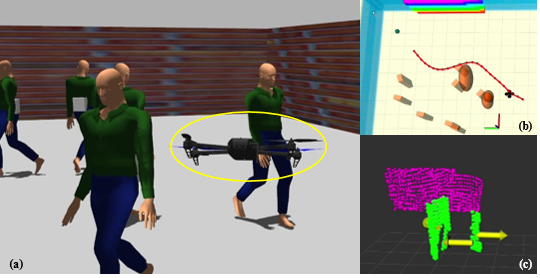
  <!-- 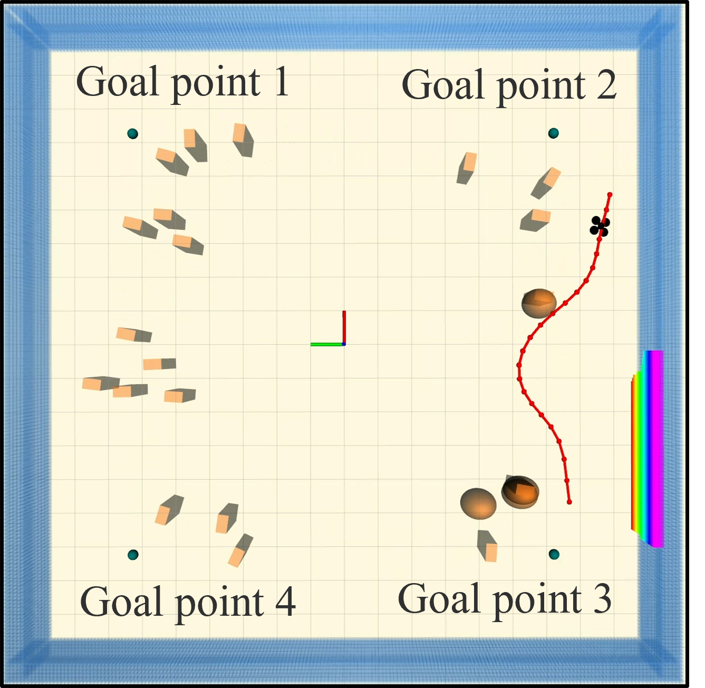 -->

针对无人机在动态环境中避障飞行进行研究。开发了一种一致性区分动态和静态点云的方法，该方法通过相邻的点云帧快速获得物体估计速度。同时针对有限感知视场无人机，提出了一种主动感知的轨迹规划方法。此外，此处根据开源行人运动库[pedsim_ros](https://github.com/srl-freiburg/pedsim_ros)在[Gazebo](https://gazebosim.org)仿真器中进行映射，以模拟真实行人的运动效果。(2024)

---

<h3 style="text-align: center;">视觉引导商用飞机着陆技术研究</h3>

  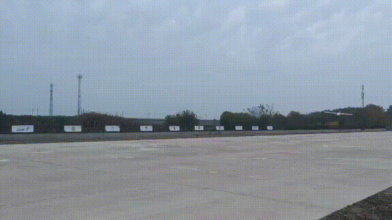
  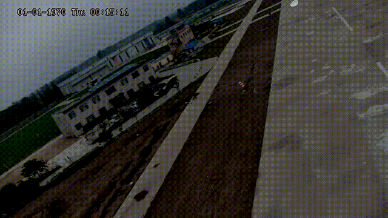

根据视觉对跑道进行语义分割，以自动引导固定翼飞机保持横向姿态。在此根据跑道中线与图像中轴的误差进行姿态控制。(2024)

---

<h3 style="text-align: center;">多无人机高速编队飞行研究</h3>

参与开发高速四旋翼无人机编队飞行研究。基于RTK提供全局定位，并通过4G模块进行消息互传，实现了速度5m/s的编队保持。(2024)

---

<h3 style="text-align: center;">可折叠全动薄膜翼微型无人机研究</h3>

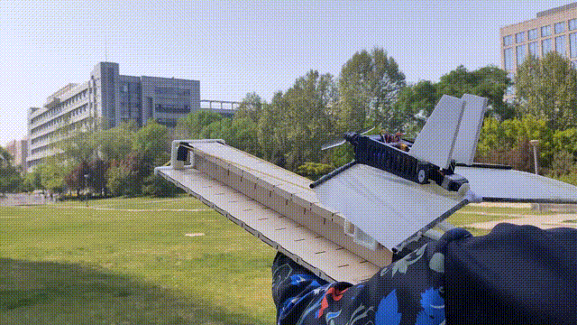

本科期间参与的柔性可折叠微小型无人机研究，其可以由折叠的状态弹射飞行，并由薄膜翼面的变形提供升力。(2021)

该项工作曾获2020年，2021年“[冯如杯](https://www-fengrubei-net.e2.buaa.edu.cn/)”学生学术科技作品三等奖，2021年第七届中国国际“互联网+”大学生创新创业大赛一等奖。

成果获得“可折叠全动薄膜翼微型无人机系统”发明专利，专利号CN202210063076.3。

---

<h3 style="text-align: center;">SE(3)空间上的四旋翼无人机轨迹跟踪控制器研究</h3>

<!-- 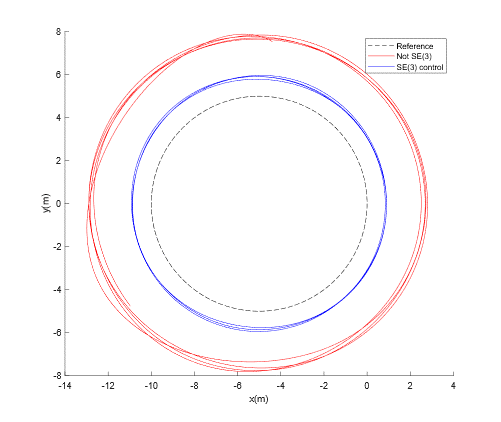 -->

  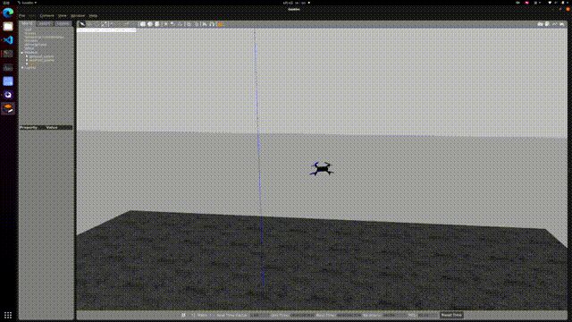
  

本科毕业设计内容，基于PX4的四旋翼无人机轨迹跟踪控制器开发。基于文献[Geometric Tracking Control of a Quadrotor UAV on SE(3)](../document/tracking_controller.pdf)原理进行开发。考虑四旋翼无人机的微分平坦特性将其姿态跟踪误差映射在SE(3)空间中进行解算以保证精确的轨迹跟踪。(2022)

---

<h3 style="text-align: center;">激光系留无人机定位与悬停控制研究</h3>

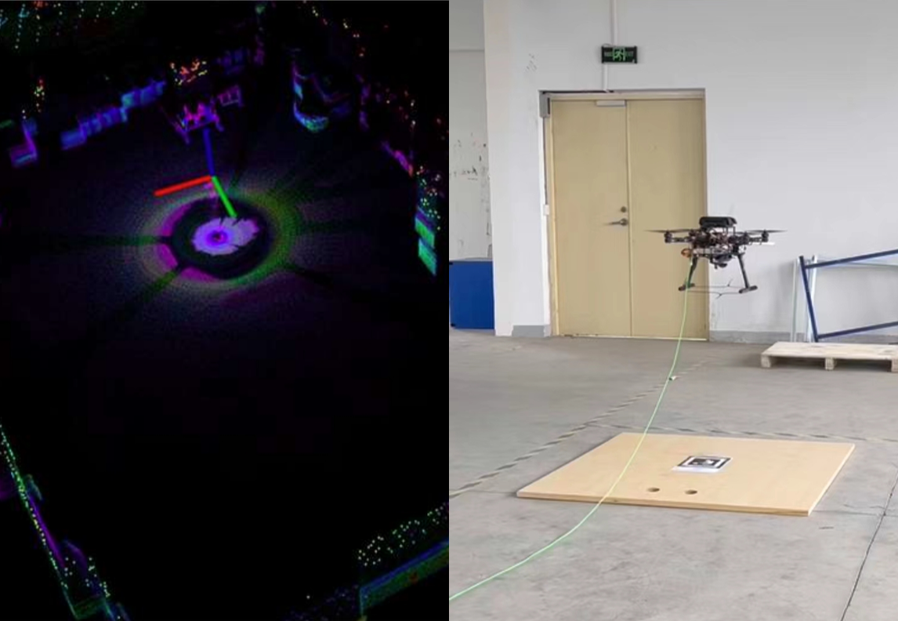

开发搭载[Livox-mid360](https://www.livoxtech.com/cn/mid-360)激光雷达传感器的系留无人机平台，并部署[FAST_LIO](https://github.com/hku-mars/FAST_LIO)算法为其提供精确定位，同时融合下视单目相机对Apriltag进行识别，以实现与地面移动机器人的跟随并精确着陆。(2023)

---

<h3 style="text-align: center;">四足机器人平台二次开发</h3>

  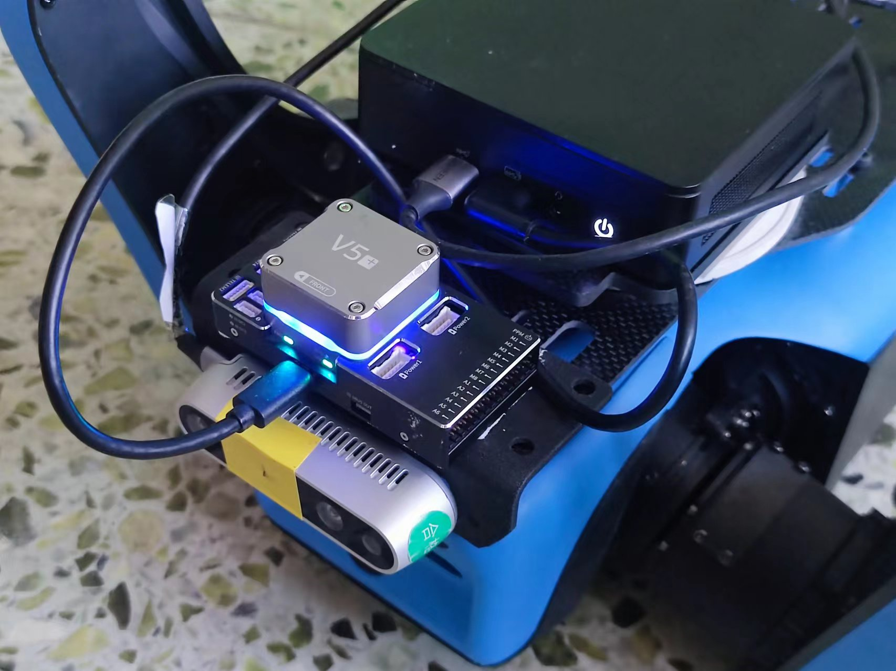
  

通过外部IMU数据以保证[VINS-Fusion](https://github.com/HKUST-Aerial-Robotics/VINS-Fusion)在四足机器人上鲁棒运行，并实时感知环境障碍物。在避障中开发了基于DWA的局部运动规划算法。(2023)  

成果获得“适用于复杂楼宇室内环境的足式机器人智能自主探索方法及装置”发明专利，专利号CN202311066365.X。

---

<h3 style="text-align: center;">四旋翼无人机智能算法竞赛</h3>

参加“[智航杯](https://www.ghstf.org.cn/ds/2403d8d577.html)”全国无人算法竞赛并获得仿真赛第一名，实物赛第三名的成绩。该算法竞赛包含无人机的未知环境自主探索，目标搜索及跟踪，识别区域降落。(2023)

## 出版物

[1] Y. Lin, Z. Meng, J. Ji, Z. Wang and W. Gai, "Efficient Perception and Obstacle Avoidance Flight of UAVs in Dynamic Dense Environments," 2024 IEEE International Conference on Robotics and Biomimetics (ROBIO). (Submitted).  

## 曾获荣誉

硕士学术奖学金二等奖，2023。  
北航优秀毕业生（学士），2022。  
学科竞赛奖学金一等奖，2021。  
创新创业奖学金一等奖，2021。  
学习优秀奖学金二等奖，2020，2021。  
“智航杯”全国无人机智能算法竞赛仿真赛第一名，实物赛第三名，2023。
北京国际“互联网+”创新创业大赛一等奖，2021.08。  
全国大学生周培源基础力学竞赛团体赛三等奖，2021.08。  
美国数学建模竞赛H奖，2021.04。  
第七届MathorCup大学生数学建模挑战赛二等奖，2021.06。  
“冯如杯”学生学术科技作品竞赛三等奖，2020，2021。

## 其他技能

编程语言：C++，python，matlab。  
开发经验：PX4飞控二次开发，Ubuntu，ROS系统，Gazebo仿真环境。  
英语：已通过CET-6，IELTS总分6.5。  
硬件能力：三维建模，无人机平台搭建。

曾搭建的无人机平台

  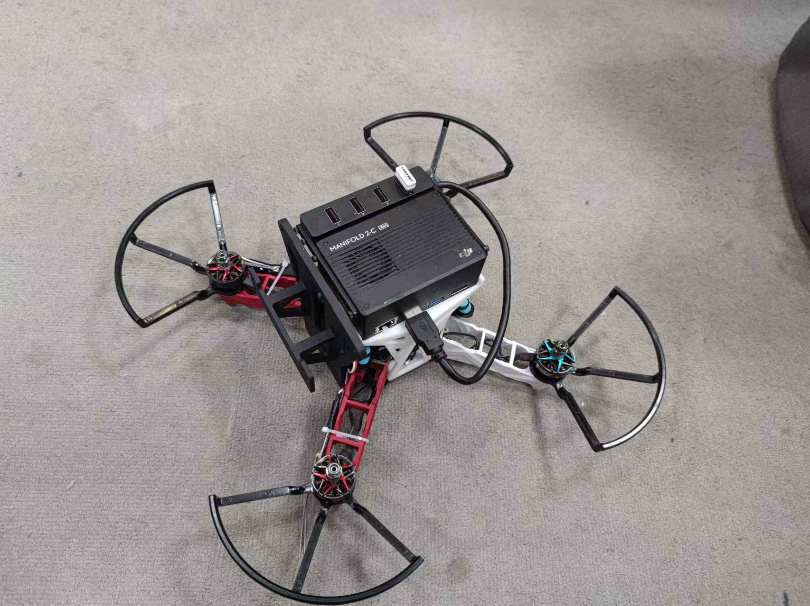
  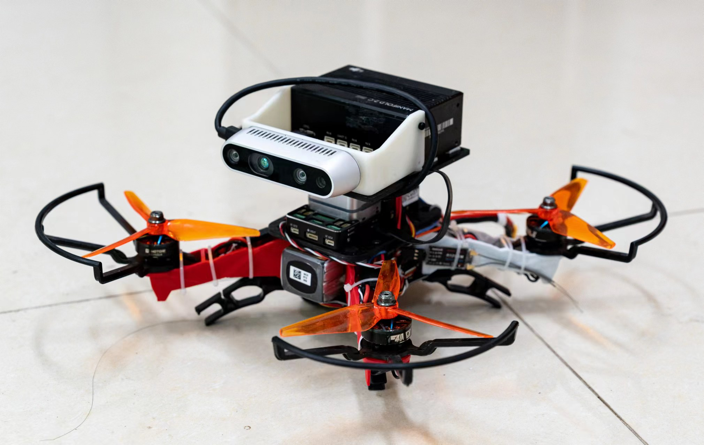
  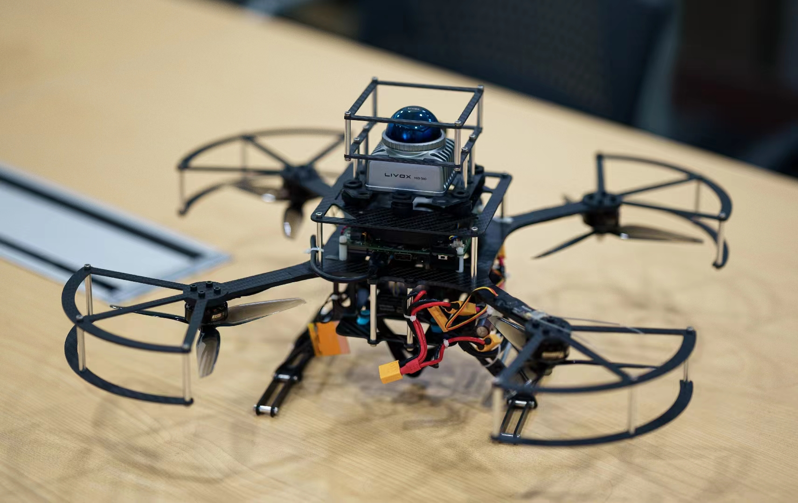

